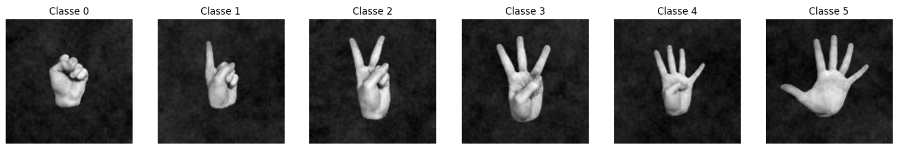

# Classificação de Gestos de Mãos com Deep Learning e Redes Neurais Convolucionais (CNN)

<div align="center">
      
</div>  

## Sobre o Projeto

Este projeto consiste em um pipeline completo de Visão Computacional com o objetivo de construir um modelo de Deep Learning capaz de identificar automaticamente a quantidade de dedos exibidos em imagens de mãos.

A solução utiliza Redes Neurais Convolucionais (CNNs) para realizar uma tarefa de classificação multiclasse, reconhecendo gestos que representam números de 0 a 5 dedos, independentemente da orientação da mão.

O projeto contempla todas as etapas de um pipeline moderno de Visão Computacional, desde a preparação dos dados até a avaliação do modelo treinado.

## Objetivo

Desenvolver um sistema inteligente capaz de:

- Classificar imagens de mãos em seis categorias (0 a 5 dedos);
- Aplicar técnicas de Data Augmentation;
- Construir e treinar uma Rede Neural Convolucional (CNN);
- Avaliar o desempenho do modelo através de métricas de classificação;
- Analisar erros e oportunidades de melhoria utilizando matriz de confusão.

## Dataset

O projeto utiliza o dataset **Fingers**, contendo milhares de imagens de mãos representando números de 0 a 5 dedos.

As imagens são utilizadas para treinamento, validação e teste de um modelo de classificação multiclasse baseado em Deep Learning.

## Principais Atividades Desenvolvidas

### Exploração e Preparação dos Dados

- Análise da estrutura do dataset;
- Extração automática de rótulos;
- Construção de DataFrames para organização dos dados;
- Avaliação do balanceamento das classes.

### Pré-processamento de Imagens

- Redimensionamento para 128x128 pixels;
- Normalização dos valores dos pixels;
- Preparação dos conjuntos de treino, validação e teste.

### Data Augmentation

- Rotação aleatória;
- Zoom;
- Deslocamentos horizontais e verticais;
- Espelhamento horizontal;
- Geração dinâmica de novas amostras.

### Desenvolvimento da CNN

- Camadas Conv2D;
- MaxPooling2D;
- Flatten;
- Dropout;
- Camadas Dense;
- Softmax para classificação multiclasse.

### Treinamento e Monitoramento

- TensorFlow/Keras;
- Adam Optimizer;
- Early Stopping;
- ReduceLROnPlateau;
- Monitoramento de Accuracy, Recall e Precision.

### Avaliação do Modelo

- Curvas de aprendizado;
- Matriz de confusão;
- Análise de desempenho por classe;
- Avaliação quantitativa do modelo.

## Arquitetura da Solução

```text
Imagem
   │
   ▼
Pré-processamento
   │
   ▼
Data Augmentation
   │
   ▼
CNN
 ├── Conv2D + MaxPooling
 ├── Conv2D + MaxPooling
 ├── Conv2D + MaxPooling
 ├── Flatten
 ├── Dropout
 └── Dense + Softmax
   │
   ▼
Classificação (0-5 dedos)
```

## Tecnologias Utilizadas

- Python
- TensorFlow
- Keras
- OpenCV
- NumPy
- Pandas
- Matplotlib
- Seaborn

## Competências Demonstradas

- Deep Learning
- Computer Vision
- Convolutional Neural Networks (CNN)
- Data Augmentation
- TensorFlow
- Keras
- Classificação Multiclasse
- Avaliação de Modelos
- Machine Learning Pipeline

## Estrutura do Projeto

```text
├── fingers/
│   ├── train/
│   |
│   └── test/
├── classificacao_dedos_imagens_cnn.ipynb
└── README.md
```

## Resultados Obtidos

O projeto demonstra a construção de um pipeline completo de Deep Learning para classificação de imagens, incluindo preparação dos dados, aumento artificial do dataset, treinamento de redes neurais convolucionais e avaliação utilizando métricas e matriz de confusão.

**Notebook do projeto:**[ aqui.](https://github.com/deivison1983/classificao_dedos_imagens_cnn/blob/main/classificacao_dedos_imagens_cnn.ipynb)

## Aplicações Práticas

- Reconhecimento de gestos;
- Interfaces touchless;
- Sistemas de acessibilidade;
- Interação homem-computador;
- Sistemas inteligentes baseados em visão computacional.

## Contexto Acadêmico

Projeto desenvolvido durante a Pós-Graduação em Inteligência Artificial e Aprendizado de Máquina, com foco na aplicação de técnicas modernas de Deep Learning para classificação de imagens.

## Autor

Deivison Morais. Visite o meu portfólio de projetos [aqui.](https://deivison1983.github.io/portfolio_projetos/)

Pós-Graduação em Inteligência Artificial e Aprendizado de Máquina - PUC Minas

Professor Orientador: Octavio Santana

### Contatos

<div>
  <a href = "https://www.linkedin.com/in/deivisonmorais/"></a>
  <a href = "mailto:deivison1983@gmail.com"></a>
</div>
